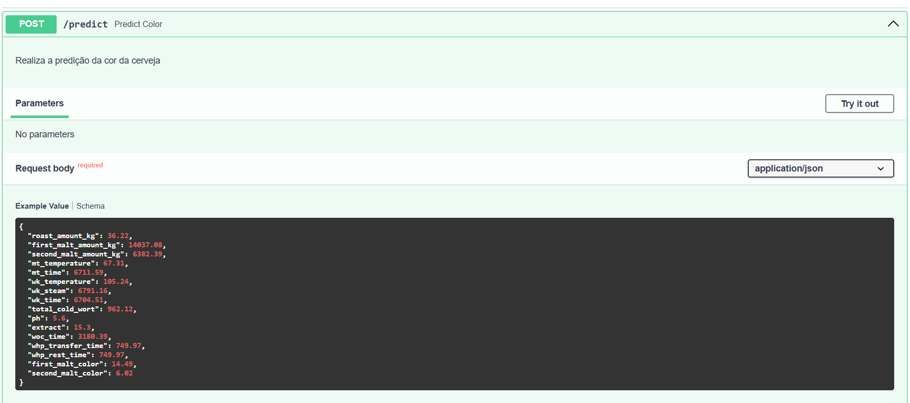

<h1>Predição de coloração de cerveja Amstel </h1>



## Contexto 📚

A cervejaria de Ponta Grossa (PG) produz cervejas das marcas *Heineken* e Amstel. A cervejaria está interessada em automatizar o processo de identificação da coloração das cervejas. Para isso, a cervejaria coletou um dataset com 800 amostras de cervejas das marcas *Heineken* e *Amstel*, onde cada amostra possui 20 atributos.

O processo de fabricação de cerveja tem duas fases principais, uma fase quente e uma fase fria. Durante a fase quente, dois tipos de maltes são moídos: um malte base que é de cor clara e vem em maiores quantidades e um **malte torrado, que tem uma cor mais escura e, portanto, é usado para dar à cerveja a cor desejada**.

Vários KPIs são monitorados durante todo esse processo. Um importante que caracteriza as marcas de cerveja é a cor. Como a cervejaria Ponta Grossa (PG) tem um problema de assertividade de cor durante o processo de fabricação, eles decidiram usar ferramentas de ciência de dados para corrigir o índice de cor da cerveja. Como é conhecimento empírico da fabricação de cerveja que a fase quente da fabricação é o que mais afeta a cor final da cerveja, a PG decidiu implementar uma ferramenta de análise avançada que prevê a cor da cerveja logo após o processo de resfriamento.

## Objetivo 🎯

O objetivo deste projeto é analisar os dados da empresa e desenvolver um modelo preditivo para identificar como as características do processo de fabricação de cerveja afetam a sua coloração.

## Estrutura do Projeto 📂

```
.
├── app # API Rest
│   ├── __init__.py
│   └── main.py
├── beer_color_prediction # Script de treinamento do modelo
│   ├── config.py
│   ├── dataset.py
│   ├── __init__.py
│   └── modeling
│       ├── __init__.py
│       └── train.py
├── data
│   ├── processed
│   │   └── dataset.parquet
│   └── raw
│       └── dataset.csv
├── Dockerfile
├── docs # Imagens do README
│   └── figures
│       ├── amstel.png
│       └── api.png
├── models
│   └── model.joblib
├── notebooks
│   ├── 1.EDA.ipynb
│   ├── 2.Modelagem.ipynb
│   └── 3.Interpretabilidade.ipynb
├── pyproject.toml
├── README.md
├── setup.cfg
└── uv.lock
```

## Configurando ambiente 🚀
Esse projeto foi criado usando o gerenciador de dependências [uv](https://docs.astral.sh/uv/), com a versão Python 3.11.

1. Clone o repositório
2. Instale as dependências e crie o ambiente virtual

    2.1 Usando o `uv`:
    ```bash
    uv sync
    ```

    2.2 Usando o `pip`:
    ```bash
    pip install -e .
    ```

3. Coloque o arquivo `dataset.csv` na pasta `data/raw`
4. Abra os notebooks na pasta `notebooks` e executar as células usando o ambiente virtual criado pelo `uv`

## Treinamento do modelo 🧠

Pré-processamento dos dados:
```bash
python beer_color_prediction/dataset.py
```

Para treinar o modelo, execute o script `train.py` na pasta `beer_color_prediction/modeling`:
```bash
python beer_color_prediction/modeling/train.py
```

## Executando a API Rest 🚀

### Python 🐍

Para executar a API Rest, execute o script `main.py` na pasta `app`:
```bash
fastapi dev app/main.py
```

### Docker 🐳

Construa a imagem do Docker:
```bash
docker build -t beer-color-prediction .
```

Execute o container:
```bash
docker run -d -p 8000:80 beer-color-prediction
```
